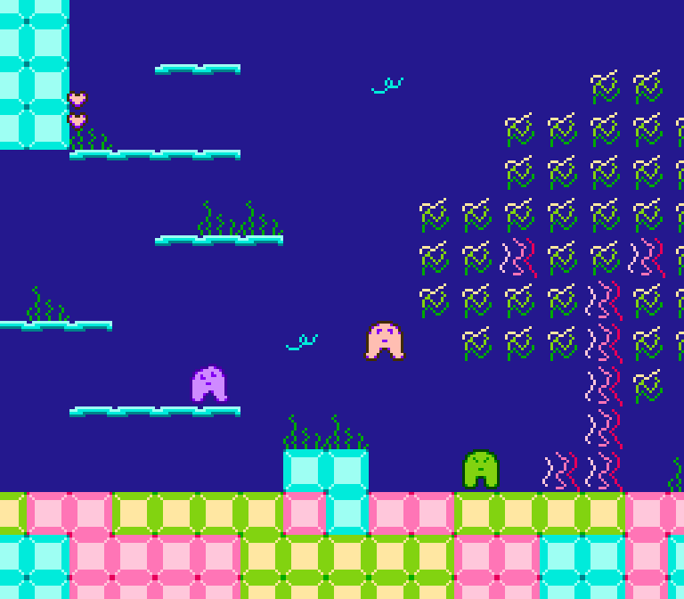

# NES Platformer Template

This is a platformer template for the NES. It contains basic player and enemy movement, as well as two-way horizontal scrolling.

## Development

Required tools:

* Python3 with pyenv
* CC65
* CMake and Make
* FCEUX (for debugging)
* FamiStudio (for editing audio)
* Tiled (for editing levels)

Linux may be required for some of the scripts to work properly. I haven't tried to build this on Windows or Mac for quite some time.

## Building the Project

Clone the repository and run the following:

```
pip install -r requirements.txt
make
make run
```

If you want to modify the emulator used for testing you can change the `EMULATOR=fceux` value in the Makefile. However, I'd suggest using FCEUX as I've built debug tools to help diagnose issues with the game.

## Debugging Script

There is a Lua script called `fceux-debug.lua` that automatically gets loaded when running a debug version of the game. This lets you enable debugging tools by clicking the mouse button in the FCEUX window. Press the button a few times to reveal more information.

You can also isolate a specific view by holding the mouse button and then cycling through each view by clicking.

## Source Overview

The `source` directory contains all the source code for the game. View the README files in each of the directory to get a better overview of what each one does.

## Terminology

* Zone - Think of this as a unique area or tileset. These are defined in `assets/data/zones.csv`
* Object - An enemy, NPC, powerup, or some other interactive object. Defined in `assets/data/object_types.csv`
* Trigger - A full height bounding box that is handled in `trigger.c`
* Megatile/Metatile - A structure for storing 32x32 megatiles in a level


